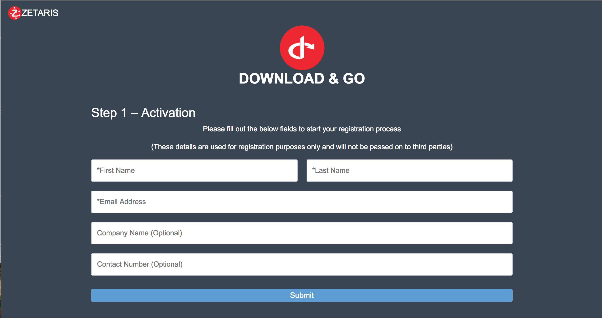
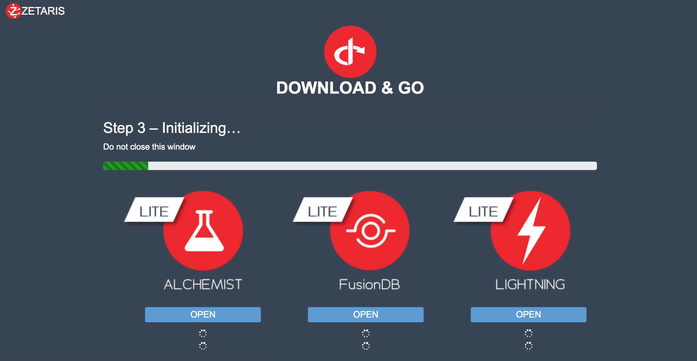

##############################
**Zetaris Platform EV Guide**
##############################

**Prerequisites**
=================

Which Virtualisation Tools To Use
-------------------------------------

The Zetaris Platform EV Virtual machine is built on Centos 7.4 and is compatible with VMWare Workstation, VMWare player and Oracle VM Virtualbox virtualisation tools. 
Others may work but are not tested.

Host System Configuration
------------------------------

* Minimum – Quad Core CPU, 16GB RAM, 10 GB Hard Drive Space
* Recommended - Quad Core CPU, 32GB RAM, 10 GB Hard Drive Space

Recommended VM Configuration
---------------------------------

When defining the system setting for the virtual machine, the important parameters to keep in mind are as follows:

* CPU:  2 CPU’s with one core each

* RAM:  Minimum 8 GB (recommended 16 GB)

NETWORK CONFIGURATION
++++++++++++++++++++++++++

*  Bridged Adapter - allows other browsers on your network to access the Web UI’s for Alchemist and Lightning. 
*  Host-only Adapter – created a closed network between the VM and the Host computer for isolated testing

**Usage Limits**
=================

The Zetaris Platform EV virtual machine has a time limited versions of Zetaris software which has also been scaled back to predetermined functionality level to ensure an acceptable whilst maintaining a compact file size for product download.

The differences as compared to a fully featured version are listed below;

Zetaris FusionDB
-----------------

Maximum database size of 500 MB, if this limit is exceed a warning is issued and you can elect to cancel an operation or drop tables to regain functionality of the database

Zetaris Lightning and Alchemist
--------------------------------

Maximum of two data sources to ensure that the VM can function effectively and reliably with the limited VM resources specified.

**Start-Up And Activaton Process**
=====================================

Once the virtual machine has been extracted and loaded into a VM host such as VmWare Player or Oracle VirtualBox, a series of steps need to be taken to activation your version of the product and eventually activation, through the below process.

Once your VM starts you will be presented with the following Console Welcome Screen which lists the authorize activities in the order that they need to be executed, Activation, Authorize and finally Access

Welcome to the Zetaris Platform – Evaluation Version

    - Activate this product : http://172.31.12.159/agent/activate
    - Authorize this product : http://172.31.12.159/agent/authorize
    - Access Zetaris Services : http://172.31.12.159/agent/status

Default Linux User
-----------------------
The Zetaris Platform EV software has been configured under a Zetaris user context. 
Once the VM has started, the default linux login credentials are as follows::

     Username: zetaris
     Password: virt_ZET_123

**This step is not required to complete the registration process but may be useful later for linux admin purposes.**

Activation
-------------

Activation is required for Zetaris to assign an authorization code which unlocks the software and starts the evaluation process.

 * Follow the ``Activate this product`` link to display the activation page shown below.
 * Fill in your ``name``, ``email address`` and ``company`` and click the submit button.

Once the activation is completed an authorization code will be emailed to you within 24 hours

Authorization
--------------

You will receive an activation response email from Zetaris which will contain your authorization code as a text string in the body of the email.

 * Copy the authorization code from the response email
 * Follow the ``Authorize this product`` link to display the authorization page shown below.
 * Paste the authorization code from the response email into the field and click submit.

Initialization and Access
--------------------------

Successful product authorization will take you to the ``Zetaris Platform`` access page which will initialize itself on first use. Once initialization is completed the page would display the services, their access URL’s and the status of the services. 

This page can be accessed at any time , so it’s recommended it be bookmarked.

**Manual Activation**
======================

The products can be manually activated instead of from GUI by issuing the below command::

    /usr/share/zetaris/agent/bin/zetaris_agent -activate <activatin key>

Once key is activated proceed to config step::
  
   sh /usr/share/zetaris/installer/zaw/bin/single_node_zaw_config.sh
