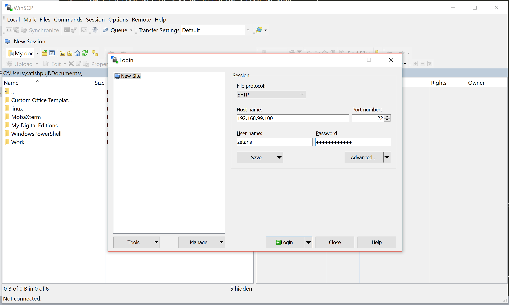
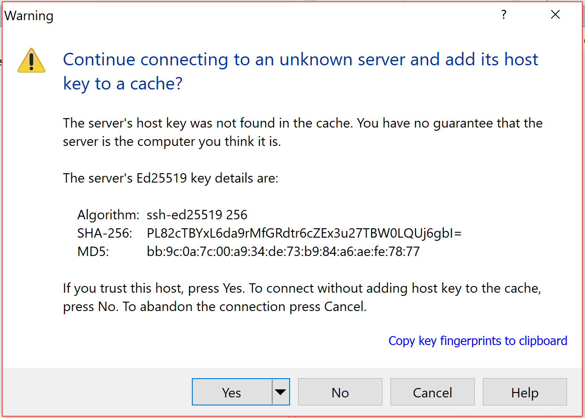
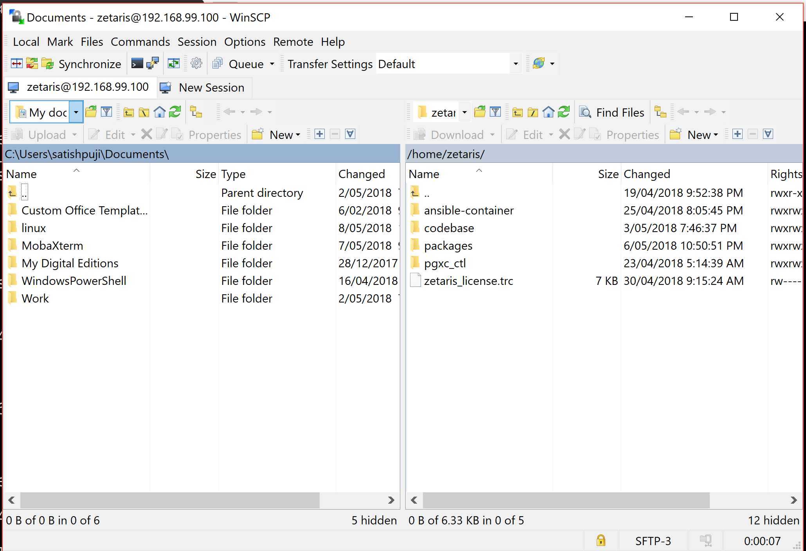
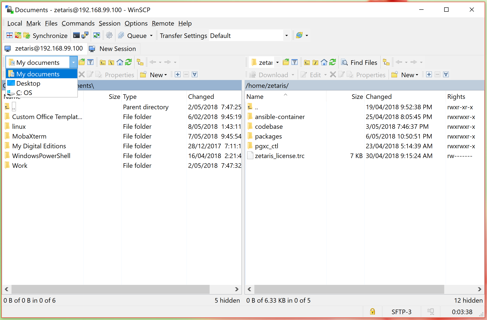
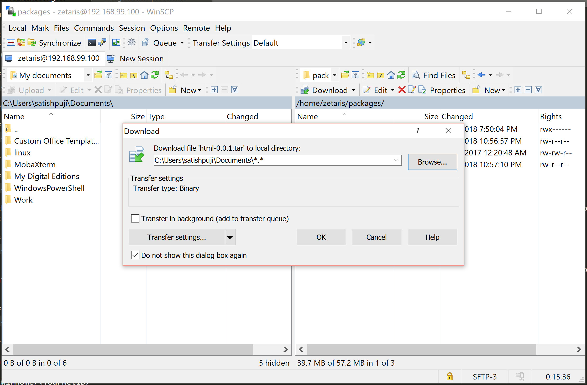

######################
TroubleShooting
######################

Error Codes
==============

+-------+-------------------------------------------------------------+
| AG001 | Failed to contact Server .                                  |
+-------+-------------------------------------------------------------+
| AG002 | Failed to create Account .                                  |
+-------+-------------------------------------------------------------+
| AG003 | Failed to create User .                                     |
+-------+-------------------------------------------------------------+
| AG004 | Failed to create License/Entitlement .                      |
+-------+-------------------------------------------------------------+
| AG005 | Failed to validate License .                                |
+-------+-------------------------------------------------------------+
| AG006 | Failed to initialise the cluster .                          |
+-------+-------------------------------------------------------------+
| AG007 | Service not available                                       |
+-------+-------------------------------------------------------------+
| AG008 | Registration  Page Error                                    |
+-------+-------------------------------------------------------------+
| AG009 | Failed to render Page. Internal Error                       |
+-------+-------------------------------------------------------------+
| AG010 | Activation Error                                            |
+-------+-------------------------------------------------------------+
| AG011 | Failed to run the activation agent                          |
+-------+-------------------------------------------------------------+
| AG012 | Invalid Activation key                                      |
+-------+-------------------------------------------------------------+
| AG013 | License not installed. Not activated                        |
+-------+-------------------------------------------------------------+
| AG014 | License key has been deactivated                            |
+-------+-------------------------------------------------------------+
| AG015 | License doesn’t cover this product                          |
+-------+-------------------------------------------------------------+
| AG016 | License has expired                                         |
+-------+-------------------------------------------------------------+
| AG017 | Failed to contact the License server.                       |
|       | Check network connection                                    |
+-------+-------------------------------------------------------------+
| AG018 | License ID file missing                                     |
+-------+-------------------------------------------------------------+
| AG019 | Unknown internal error when validating license.             |
+-------+-------------------------------------------------------------+

* If you find the services in waiting mode for ever then

   - Login into the box and the copy across the log folder - /srv/zetaris/logs and email us ``@ support.zetaris.com``

   - If you find the services fail to start up send us the logs.

How to transfer the Logs?
=========================

Accessing your Linux files from Windows
----------------------------------------

If there are files in your Linux environment you'd like to use in your Windows environment, you can use the WinSCP tool to copy them over.

From a Windows system, load the pre-installed WinSCP program. When prompted, enter the following data::

    Host name: 192.168.99.100 (IP address of zetaris VM)
    User name: zetaris
    Password: zetaris password

Accept the prompt to add server and it's host key to cache if prompted.

Once connected, you'll be presented with a split-window view with your Windows system on the left and the Zetaris Linux files on the right.

In the left side of the Window, above the file and directory listings, change the "My Documents" drop-down and select the drive/path where you want to save the files.

The listing of files will refresh with your selected drive contents. You can now drag/drop folders and files between sides to copy them between locations.

