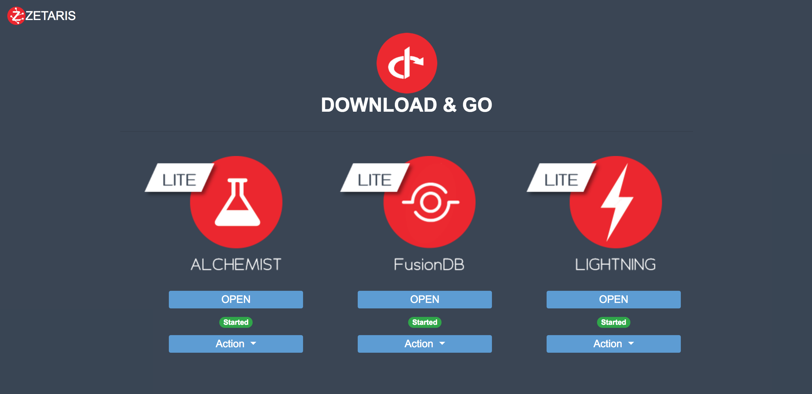

##########################################
**Quick Start Guide for Zetaris Platform**
##########################################

This section describes how to manage the Zetaris Platform servers and how to connect to them through a Web UI. All servers are registered as a service so that all relevant daemons are automatically kicked off at platform boot-up

**Check Status, Start and Stop Zetaris Services**
==================================================

The platform access page is the central dashboard for the platform. You can access all the services from here. The platform access page provides support for monitoring the services and controlling them. To start a service use the action dropdown and select start. On starting the status would be highlighted as waiting. When the service is ready to use the status would be shown as started. To access the service click the URL on the respective product entry.

**Advanced User Options** 
==========================

User can always login to the box using ``ssh`` and their favourite utility such as ``puTTY, Filezilla ,Cyberduck`` or other similar software. All the Zetaris products are registered as system services and  the image is built upon Centos 7.4. 

The installed services are ::

      •	Lightning GUI – zetaris-lightning-gui
      •	Lightning – zetaris-lightning
      •	FusionDB – zetaris-fusion
      •	Alchemist – zetaris-alchemist-report

**To control these services, use the following service commands;**

**Lighting Server**
-------------------- 
::

    Checking Service Status - sudo service zetaris-lightning status
    Starting the Service - sudo service zetaris-lightning start
    Stopping the Service - sudo service zetaris-lightning stop

**Lightning GUI**
------------------
::

     Checking Service Status - sudo service zetaris-lightning-gui status
     Starting the Service - sudo service zetaris-lightning-gui start
     Stopping the Service - sudo service zetaris-lightning-gui stop

Once Lighting GUI Server is running, connect to ``http://<local IP Address>:9001``
::

      Username: admin
      Password: password

**Lightning Notebook server**
-------------------------------
::
      
     Checking Service Status - sudo service zetaris-lightning-notebook status
     Starting the Service - sudo service zetaris-lightning-notebook start 
     Stopping the Service - sudo service zetaris-lightning-notebook stop

Once Lighting GUI Server is running, a user can connect to ``http://<local IP Address>:9080``

Click here to download driver for Lightning server

:download:`Lightning-driver.zip <doc/Lightning-driver.zip>`

**Alchemist Reporting Server**
--------------------------------
::

    Checking Service Status - sudo service zetaris-alchemist-report status
    Starting the Service - sudo service zetaris-alchemist-report start
    Stopping the Service - sudo service zetaris-alchemist-report stop

Once Alchemist Server is running, connect to  ``http://<local IP Address>:8080/zetarisbi/``
::

      Username: test@test.com
      Password: test@123

**Fusion DB - Start/Stop/Status**
----------------------------------
::

     Checking Service Status - sudo service zetaris-fusion status
     Starting the Service - sudo service zetaris-fusion start
     Stopping the Service - sudo service zetaris-fusion stop

::

     Username: zetaris
     Password: zetaris!23

* The data folder is located under : /srv/zetaris/<product>
* The logs are located under : /srv/zetaris/logs/<product>
* The runtime service logs can be viewed using : journalctl -u <service name>

For more detailed information these services please refer the usage guides for each.
Available at ``http://www.zetaris.com/yada_yada``

  

