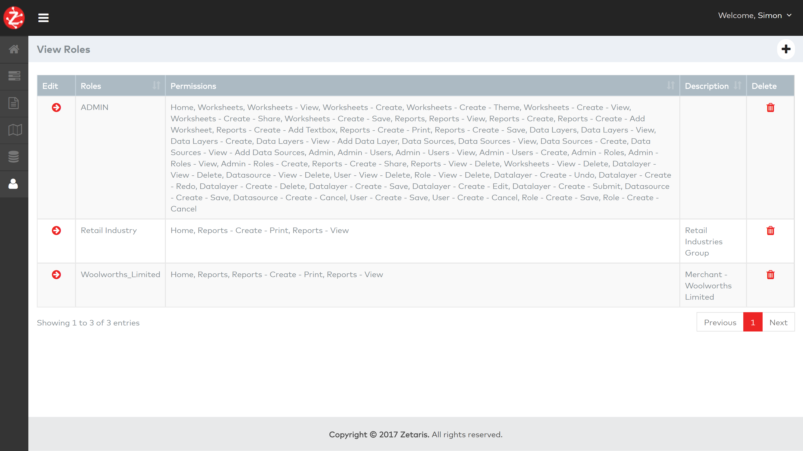
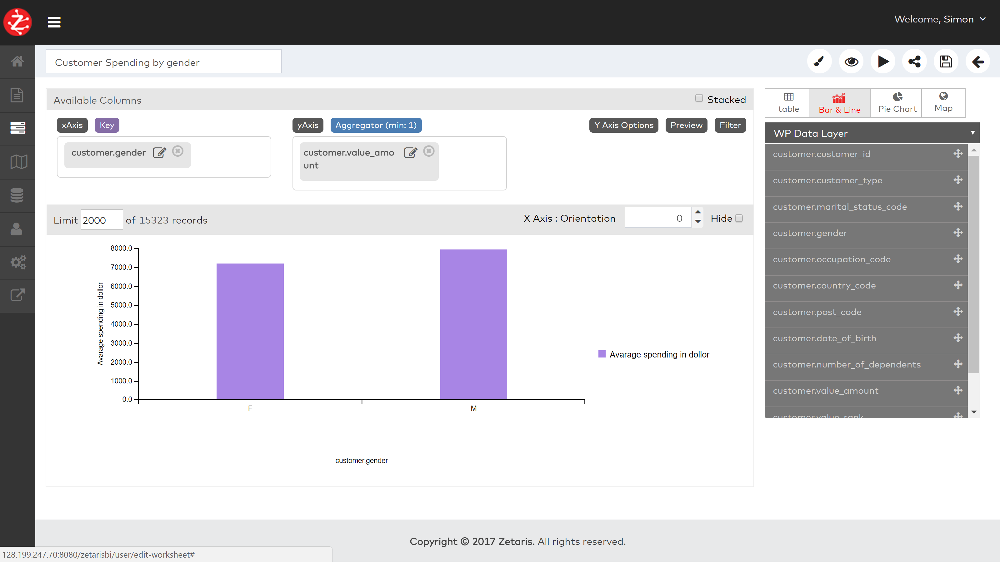
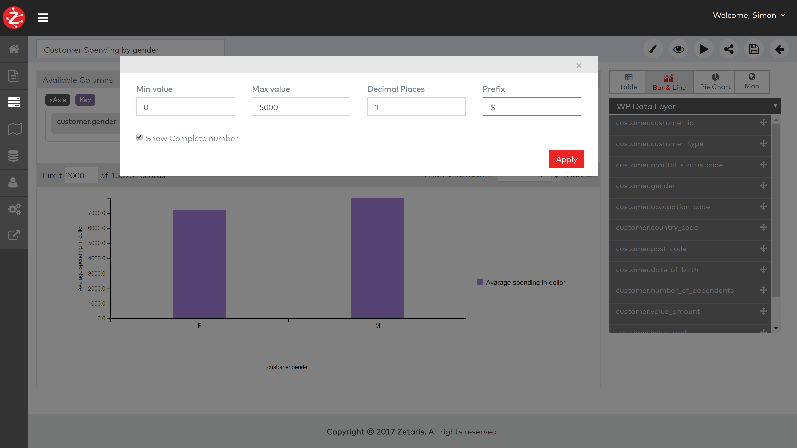
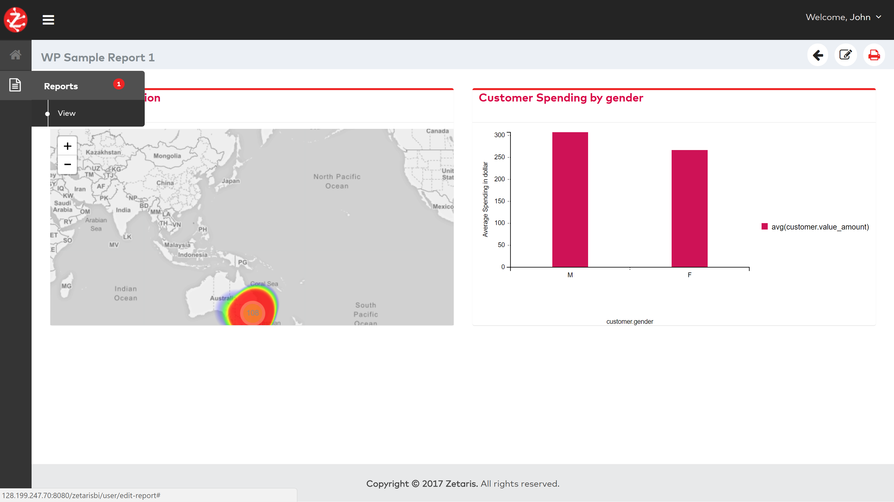

########################################
Quick Start Guide For Zetaris Alchemist
########################################

Administrator User Stories
===========================

Alchemist Admin Will Be Able To Create Industry Access Group
----------------------------------------------------------------

a)  Login as Admin User 
++++++++++++++++++++++++

Login as Admin user, select Admin -> Roles -> Create option from the menu 

b) Access Group Name
++++++++++++++++++++++

 Enter the role name (access group name) and select permissions from the list available. 

c)  Role/Group 
++++++++++++++++++++

Role/Group will be saved and listed in screen below

Alchemist Admin Will Be Able To Create A Worksheet Or Dashboard And Assign To Industries, Merchants Or Users
------------------------------------------------------------------------------------------------------------------

a)  Create Data Source 
++++++++++++++++++++++++

To create data source, select menu -> Data Sources -> Create option 
Enter required details and save data source 

b)  Create Layer
+++++++++++++++++++

To create data layer, select menu -> Data Layers -> Create option 
Enter Layer name and description and click on Create Layer button

This will now open data layer screen, select data source from available list.
Once data source is selected, it will list all the table from that data source.

Drag and drop set tables required to create worksheets to the layer area. 

Optionally relations can be established among the entities/tables by drawing the line between fields to associate with. Line can be drawn by dragging the pointer from source filed to target field on another entity.

c)  Create Worksheet
++++++++++++++++++++++

*   To create worksheet, select menu -> Worksheets -> Create option 
*   Enter worksheet name at the text box present at top.
*   Select the type of visualization you want from option table, bar & line, Pie chart, Map. 
*   Then select data layer which you want to use to create worksheet. 
*   Every visitation has different parameters e.g. Bar and Line needs data for x and y axis to select and Map need longitude and latitude. Drag and drop the fields from layer to appropriate parameters which you want to plot on graph. 

For example: Following visualization is for map, to plot this drag and drop longitude and latitude fields from layers to longitude and latitude parameters on map, select the name value which you want to show o data points on map.  

Example 2: The worksheet below shows the creating worksheet with bar chart. 

.. figure::  img/10.png
   :align:   center

In case of bar & line chart select the fields for x and y axis as shown in screen by dragging from right side list and dropping to appropriate box, x or y axis

Click on Edit icon next to field in y axis, select aggregation as avg (average), select visualization i.e. bar or line etc. optionally you can label to y axis using label field. 

On click of Apply on above popup or click on Preview button graph will displayed. 
  

You can set additional properties for Y axis by clicking on “Y-axis option button”

Click on apply to reflect the changes

**Click on Save icon to save the worksheet**

This will allow you to select the color of your choice for graphs.

This will open graph in view mode.                                  

On click of this button will reload the graph with latest data from datasource.

This will allow you to share the worksheet with other users/groups

This will save the worksheet

d)  Creating Report
++++++++++++++++++++

•   To create report, select menu -> Reports -> create. 
•   Click on Add a worksheet, select the worksheets which you want to add on report and click on ‘Add’ button. 
•   Give name to report from top text box and click on save.

Report will display selected worksheet. Worksheets can be arranged on report by clicking on navigation buttons

Created Report can be set as home page (dashboard) from the list report screen as shown below.

Merchant Request Access
========================

A Merchant User Would Request Alchemist Administrator For A Dashboard/Worksheet
===================================================================================

Alchemist Admin will check if merchant exist
----------------------------------------------

**If Merchant does not exist**

Alchemist administrator will create a merchant access group and will be able to select the industries to whom this access group belong (This could be left empty)
------------------------------------------------------------------------------------------------------------------------------------------------------------------------

To create merchant group, select option menu -> Admin -> Roles create
Enter role name (merchant name) and select permissions and click on save 

In This scenario, the user will inherit all the industry related worksheets/dashboards
---------------------------------------------------------------------------------------

In this case reports related to industry needs to be shared with merchant group in order to do that. Click on share button on report list.

Select the merchant group which you want to share report with and click on share

**If Merchant exist**

Alchemist administrator will simply add a user and assign to the merchant access group
----------------------------------------------------------------------------------------

To Create user to merchant group select menu -> Admin -> user -> Create, enter the details, select merchant Role you want to add user in and click on save

In This scenario, the user will inherit all the merchant worksheets/dashboards.
---------------------------------------------------------------------------------

Login with Merchant user you just created, default password is User@123

Go to menu -> Report. Reports shared with the merchant group will appear for user of the merchant group

Report displayed for user of merchant group

External tools links
=====================

Alchemist allows admin to add links to external tools, which can be displayed to and accessed by users within application itself.

Select the Alchemist -External Link option and click on Create

Enter name and external link and click on Save

Added link can be accessed from Alchemist – Development Tools section

On click application will be opened within alchemist. 

