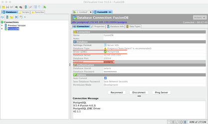

#######################################
Quick Start Guide for Zetaris Fusion DB
#######################################

Zetaris FusionDB is a distributed database capable of both OLAP and OLTP workloads.

FusionDB has been engineered to work with Zetaris Lightning data virtualisation technology as a data source but also provides connectivity to for any client using an ODBC/JDBC connector.

*	Architecture
*	Starting FusionDB
*	Monitoring FusionDB
*	Shutdown of  FusionDB
*	Connecting to Fusion DB
*	Creating Partition Tables  
*	creating  distributed tables
*	creating replicated  tables
*	SQL Execution

Architecture 
==============

The Fusion DB consists of four main components:

The Coordinator
----------------

Handles the parsing and planning of queries which are then pushed to the data nodes.
The data store not coordinator but data nodes

Datanode
----------

Stores data and is processes the queries pushed down from the coordinator

Global Transaction Manager(GTM)
-----------------------------------

Handles the transaction management and across the data nodes in the cluster.

Cluster management tool (PGXC_CTL)
------------------------------------

Start , Stop and Monitor all nodes in cluster.

Starting FusionDB 
==================

*	Start the cluster management tool, pgxc_ctl .
*	``pgxc_ctl -c /srv/zetaris/zmpp/config/pgxc_ctl.conf``
*	Execute start all command to start FusionDB.
*	Syntax: PGXC> ``start all``

Sample output of the monitoring all command: ::
   
    Start GTM master
    server starting
    Starting coordinator master.
    Starting coordinator master coord1
    LOG:  redirecting log output to logging collector process
    HINT:  Future log output will appear in directory “pg_log”.
    Done.
    Starting all the datanode masters.
    Starting datanode master datanode1.
    Starting datanode master datanode2.
    LOG:  redirecting log output to logging collector process
    HINT:  Future log output will appear in directory “pg_log”.
    LOG:  redirecting log output to logging collector process
    HINT:  Future log output will appear in directory “pg_log”.
    Done.

Monitoring Fusion DB
======================

*	Start the cluster management tool, pgxc_ctl .
*	``pgxc_ctl -c /srv/zetaris/zmpp/config/pgxc_ctl.conf``
*	Execute  monitor  all command to ``monitor  all`` nodes in the FusionDB cluster.
*	Syntax: PGXC> ``monitor all``

Sample output of the monitoring all command: ::

    PGXC monitor all
    Running: gtm master(localhost:20001)
    Running: coordinator master(localhost:20004) coord1
    Running: datanode master(localhost:20008) datanode1
    Running: datanode master(localhost:20009) datanode2

Shutdown of FusionDB
=====================

*	Start the cluster management tool, pgxc_ctl .
*	``pgxc_ctl -c /srv/zetaris/zmpp/config/pgxc_ctl.conf``
*	Execute ``stop  all`` command to shutdown Fusion DB cluster.   
*	Syntax: PGXC> ``stop all``

Sample output of stop all command: ::

    PGXC stop all
    Stopping all the coordinator masters.
    Stopping coordinator master coord1.
    Done.
    Stopping all the datanode masters.
    Stopping datanode master datanode1.
    Stopping datanode master datanode2.
    Done.
    Stop GTM master
    waiting for server to shut down... done
    server stopped

Connecting to FusionDB
========================

There are typically two ways to connecting Fusion DB cluster :

Psql from the linuc command line
  
*	psql -p 20004 -h localhost postgres

*   Sample output of executing above psql displayed below: ::

     psql 
     psql (PGXL  , based on PG 9.5.5 (Fusion 4.1.1))
     Type "help" for help.

     postgres=# 

ODBC/JDBC connectivity allows any compatible to connect, below is a DB Visualiser example.

DbVisuliser
------------

*	Download DbVisualizer through the web site, https://www.dbvis.com/download/

*	Choose JDBC driver as Postgresql , and set Database as postgres when creating new connection in the DbVisualizer :

The connection string for the database is - ``jdbc:postgresql://172.16.15.141:20004/postgres`` and the credential::
  
   username  'zetaris' 
   password 'zetaris!23

Creating partition tables
==========================

There are two kinds of partition tables which can be created in FusionDB;

A distributed table 
--------------------

where the records of the table are stored across the available nodes in a cluster. This can be any number starting with one.

A replicated table
-------------------

where copies of the table are deployed to each data node.This can be any number starting with one.

Creating distributed tables
-----------------------------

You can create a distributed table using the ``DISTRIBUTE BY HASH`` clause by specifying a distributed column. ::

     CREATE TABLE sample_dist_table (x integer,y char(10))DISTRIBUTE BY HASH(x);

Creating replicated tables
---------------------------

You can create a replicated table using the ``DISTRIBUTE BY REPLICATION`` clause.::

     CREATE TABLE sample_replicate_table (xinteger)DISTRIBUTE BY REPLICATION;

SQL Execution  
===============

FusionDB SQL syntax is completely compatible with Postgres9.5. 
 
To explore this in detail, refer https://www.postgresql.org/docs/9.5/static/sql-syntax.html .
