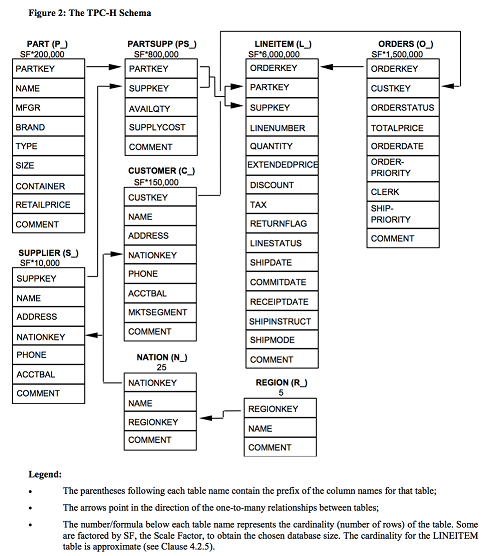

############
Exercise 1
############

This is an introduction to the zetaris platform. It introduces to the user the different components
- Lightning
- Alchemist
- Fusion

Before you start the exercise make sure that you got the **Platform VM** up and running.Follow the instructions under `Download and Go start guide <../Platform-VM/index.rst>`_ to get it through.

This exercise is split into 3 parts:

- Creating and Loading the table into FusionDB
	- Querying the table

- Creating and Loading tableinto Lightning
	- Querying the table

- Visualing the data in Alchemist.

.. note:: Scripts and Files

Browse the code for this exercise at files_.
The same files can also be located under /srv/zetaris/docs/html/files in the respective containers.

.. _files: ./files/exercise2

**Creating and Loading table into FusionDB** - Connect to FusionDB using your favorite SQL Editor `refer <../fusion/>`.

- Connect from external tools

    - DBVisualizer
    - Other tools

-Loading data into DB

     - SSH
     - SFTP clients – Filezilla, CyberDuck

- Preparing the data

- Querying the Data

     - Running sample TPCH queries

- Querying from Lightning GUI

- Performance parameters in VM

    - 615 MB Shared Buffer  -1/4 of available RAM
    - 1231 MB effective cache - 1/2 RAM

- Familiarising Lightning GUI

- Registering tables .

- Creating tables in hive

    - SFTP loading files into the box
    - Inferencing

- Query

     - Inter Hive ZMPP queries

- Performance Parameters in VM

     - LGHT_THREAD=2
     - LGHT_EXEC_MEM=400m
     - LGHT_DRIV_MEM=3692m
     - -Xmx3692m

- Creating a Basic report from Fusion

- Creating a Basic Report from Lightning

     - Performance Parameters
     - -Xms512m -Xmx2048m
