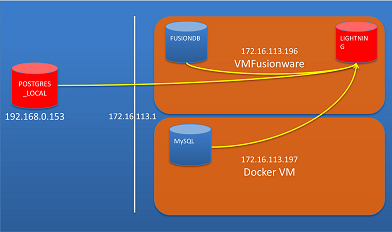
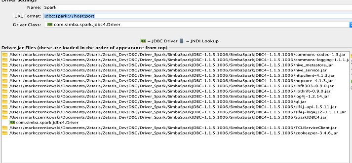
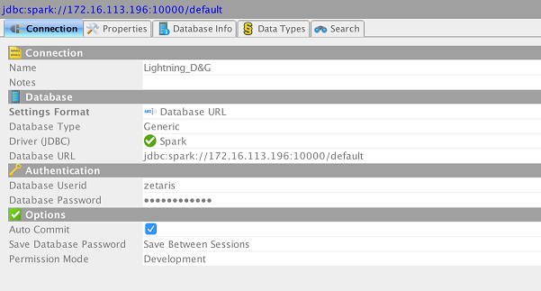
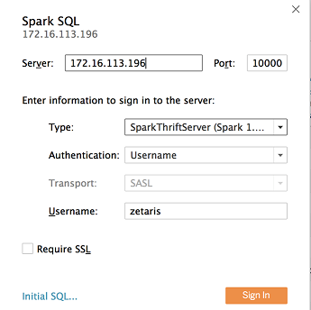
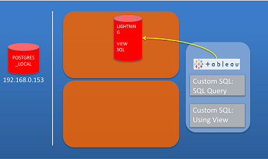

##################
Exercise 2
##################

This exercise is aimed at introducing Data vitualization using the Zetaris Platform.
To complete this exercise you will need the following setup

      - Zetaris Platform VM
      - Postgres
      - Mysql

If you find it difficult to set the database up and running. You can get the respective contianer from zetaris docker hub and get it up and running

**Zetaris Platform VM**

 Follow the instructions under `Download and Go start guide <../Platform-VM/index.html>`_.

**Postgres**

 Pull the postgres container::

     docker pull zetaris/zetaris-postgres

 To init the postgres::

     docker-machine ssh vm mkdir postgres
     docker run -ti  --security-opt=label:disable -v /home/docker/postgres:/srv/zetaris/postgres:rw zetaris/zetaris-postgres:9.6-3 /init.sh

 To spin up the container::

     docker run -d -ti --security-opt=label:disable --name postgres -p 5432:5432 -v /home/docker/postgres:/srv/zetaris/postgres:rw zetaris/zetaris-postgres:9.6-3 /bin/bash`

 To start postgres::

     docker exec -d -ti --user postgres:postgres postgres /start.sh

 To stop postgres::

     docker exec -d -ti --user postgres:postgres postgres /start.sh

**Mysql**

 Pull the mysql container::
 
     docker pull zetaris/zetaris-mysql
 
 Initialize and run the database ::
 
     docker-machine ssh vm mkdir mysql
     docker run --name mysql -v /home/docker/mysql:/var/lib/mysql -e MYSQL_ROOT_PASSWORD=vssvss -p 3306:3306 zetaris/zetaris-mysql
 
 Change permissions for lightnign to connect ::
 
     docker exec -ti mysql bash
       - mysql -uroot -p
         - GRANT ALL ON *.* to root@'%' IDENTIFIED BY ‘vssvss'
 
 To start mysql::
 
     docker start mysql
 
 To stop  mysql::
 
     docker stop mysql

.. note:: Browse the code for this exercise at files_.The same files can also be located under /srv/zetaris/docs/html/files in the respective containers
.. _files: ./files/exercise2

**Use Case focuses on Data Virtualisation from 3 datasources**

 - Fusion DB:  within Download and Go VM
 - MySQL:  within Docker VM
 - Postgres: local machine database

Use Case:
  Provide a geographical visualisation for the concentration of customers from a CRM

Business query from 3 different datasets
 - ABS Geographic data
 - Customer data
 - Customised Australia Post Postcode data

Creation of Tables in FusionDB
~~~~~~~~~~~~~~~~~~~~~~~~~~~~~~

 - Create Australia Post Merchant Data

     - Fusion_DB_postcode.sql script
     - Postcode,state,postcode_name, description, Multi_suburb
     - /tutorial/files/exercise2/scripts/fusion/postcode_data.sql

 - Create Datasource FusionDB::

    CREATE DATASOURCE FusionDB DESCRIBE BY "PostgreSQL" options(
     jdbcdriver "org.postgresql.Driver",
    jdbcurl "jdbc:postgresql://172.16.113.196:20004/dg",
    username ”zetaris",
    password ”zetaris!23",
    schema_prepended_table "true");

 - Register Datasource FusionDB tables

Creation of Tables in Postgres
~~~~~~~~~~~~~~~~~~~~~~~~~~~~~~

  - Create Customer CRM data

       - Local_mcr_data.sql script
       - First name, Last name, Company Name
       - Address, City,State, Post, phone1, phone2, email, web
       - /tutorial/files/exercise2/scripts/postgres/poa_data.sql

  - Create Datasource Postgres_Local::

     CREATE DATASOURCE POSTGRES_LOCAL DESCRIBE BY "PostgreSQL" options(
         jdbcdriver "org.postgresql.Driver",
     jdbcurl "jdbc:postgresql://172.16.113.1:5432/dg",
     username "markczernkowski",
     password "postgres",
     schema_prepended_table "true");
     Register Datasource Postgres_Local tables

  - Register Datasource Postgres_Local tables

Creation of Tables in MySQL
~~~~~~~~~~~~~~~~~~~~~~~~~~~

  - Create amended GIS ABS data

       - Docker_poa.sql script
       - Gid, poa_code, poa_name
       - sla_code11, lga_code, longitude, latitude
       - /tutorial/files/exercise2/scripts/mysql/mcr_data.sql

  - Create Datasource MySQL::

    CREATE DATASOURCE MYSQL DESCRIBE BY "Mysql database" OPTIONS (
    jdbcdriver "com.mysql.jdbc.Driver",
    jdbcurl "jdbc:mysql://172.16.113.197:3306/dg",
    username "root", password "vssvss",
    schema_prepended_table "true");
    Register Datasource MySQL tables

  - Register Datasource MySQL tables

**Spark Drivers**

         - https://www.simba.com/drivers/spark-jdbc-odbc/

Dbvisualiser
~~~~~~~~~~~~

Tableau
~~~~~~~
/tutorial/files/exercise2/scripts/lightning/query_table.sql

